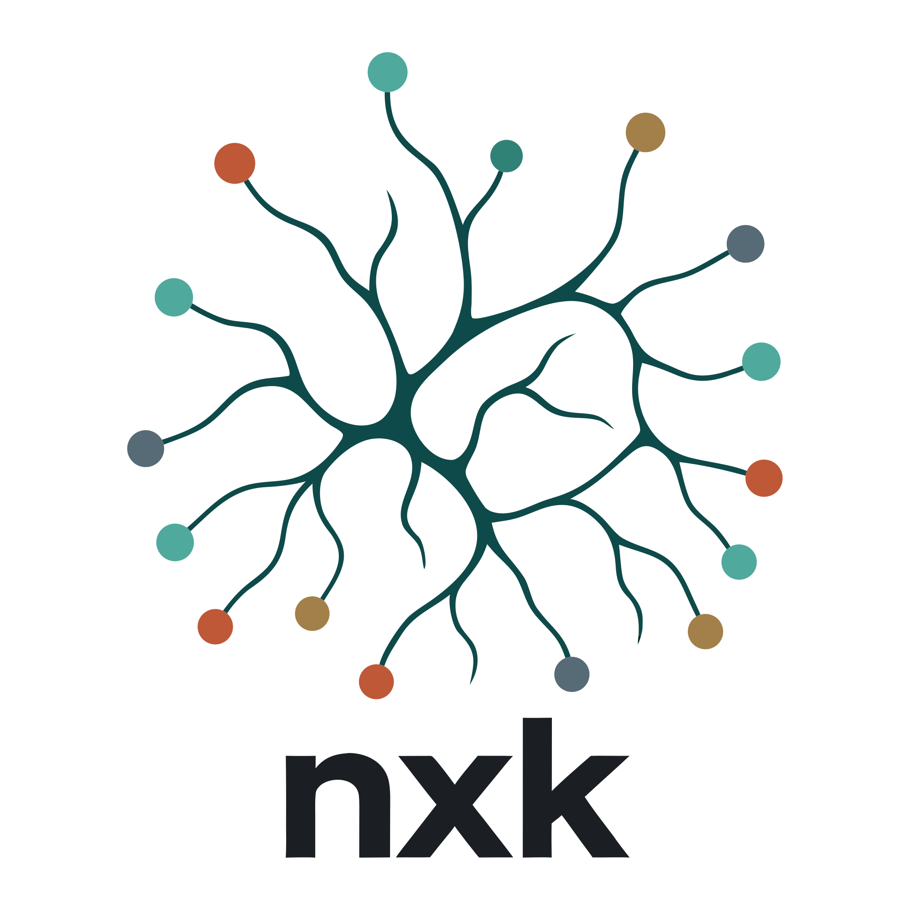
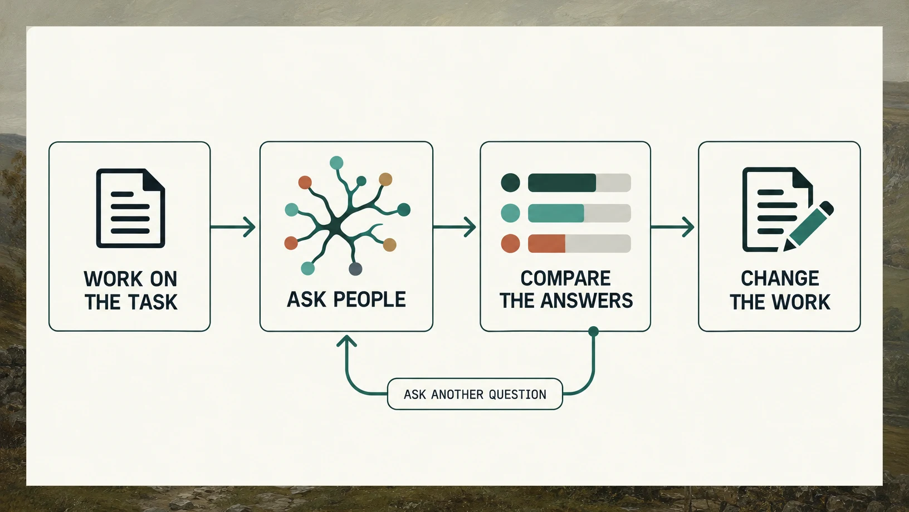
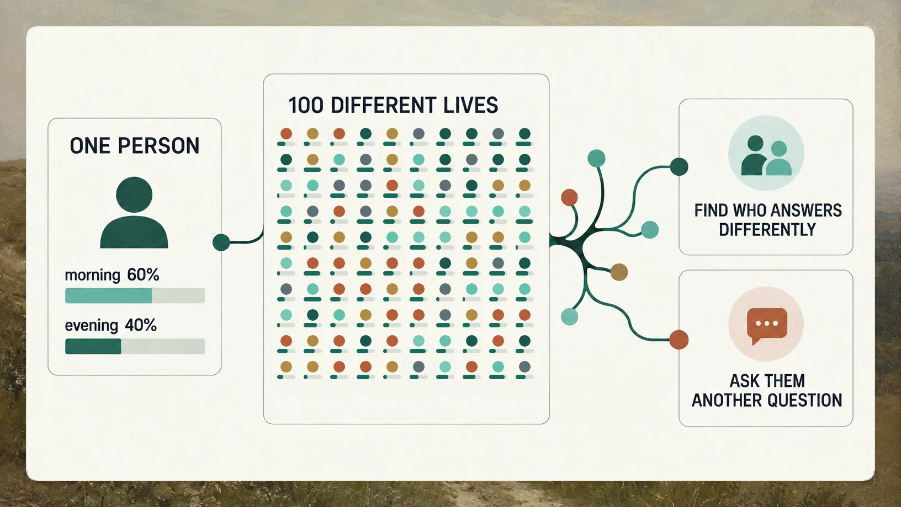
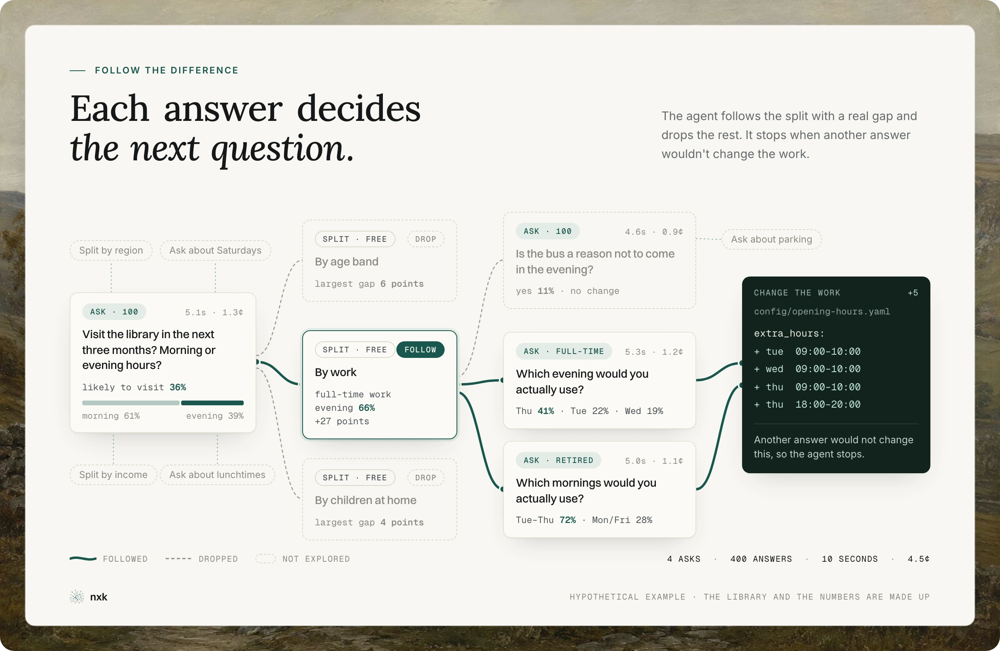

<h1 align="center">
  <picture>
    <source media="(prefers-color-scheme: dark)" srcset="assets/nxk-logo-dark.svg">
    
  </picture>
</h1>

<p align="center">
  Give your agent a crowd. Make something more people want.
</p>

<p align="center">
  <a href="#quick-start">Quick start</a> ·
  <a href="#how-it-works">How it works</a> ·
  <a href="#why-use-it">Why use it</a> ·
  <a href="#who-are-the-people-and-what-is-personagen">PersonaGen and the "people"</a> ·
  <a href="#what-it-costs">Cost</a> ·
  <a href="methodology.md">Does it work?</a> ·
  <a href="#faq">FAQ</a> ·
  <a href="#skill-and-api-references">References</a>
</p>

---

nxk is a skill for coding agents. When your agent needs to know how people
might respond to its work, nxk gives it a crowd to ask. The crowd is a set of
simulated people, not real ones.

[PersonaGen](https://personagen.dev) gives each one a detailed profile, with a
job, a home, and habits that fit together. Your agent sends each profile to a
model (I recommend [Jev](https://typesafe.ai)) and asks the model to answer as
that person. With Jev, each answer costs a fraction of a cent, so 100 people can
answer a question for about a cent. These people do not all answer in the same
way, because the answer depends on the life in the profile.

nxk shows you which people answer differently and what they have in common, so
your agent can work out who cares and who it is building for. It can ask those
people more questions and follow the differences that look interesting. It
keeps what works and drops what does not. That way, the agent makes something
people are more likely to want.

## Quick start

Copy this into your agent:

```text
Install the nxk skill by running `npx skills add albri/nxk`
and selecting your agent.

Read the skill at:
https://github.com/albri/nxk/blob/main/SKILL.md
Raw: https://raw.githubusercontent.com/albri/nxk/main/SKILL.md

Follow its setup instructions, using any credentials already available.
If I need a PersonaGen key, direct me to https://personagen.dev/signup.

You'll also need access to a model. I recommend Jev:
https://typesafe.ai. Use my preferred model if I have one.

Help me configure any missing access. Then inspect this project and find one
current decision where people's reactions could change the work. Ask a small
relevant audience, follow one useful difference, then make the change. Keep
the result brief.
```

## How it works

<picture>
  <source media="(prefers-color-scheme: dark)" srcset="assets/diagrams/inside-the-task-dark.webp">
  
</picture>

**Hypothetical example:** The library and the numbers are made up. A local
public library has the funding and staff to open for five more hours each week.
An agent could use nxk to decide when:

| What the agent does | What nxk finds | What changes |
| --- | --- | --- |
| Checks who is likely to visit | Next three months: all adults 36% · retired people 68% · people in full-time work 14% | Weight later answers by each person's chance of visiting |
| Asks likely visitors whether morning or evening hours would help more | Morning 61% · evening 39% | Start with three morning hours and two evening hours |
| Looks for groups that answer differently | Evening support among likely visitors in full-time work is 66%, 27 percentage points above all likely visitors | Do not put all five hours in the morning |
| Asks which days help each group | Retired people prefer weekday mornings · people in full-time work prefer Thursday evening | Put three hours across weekday mornings and two on Thursday evening |

For each person, the model gives every answer a probability.

<picture>
  <source media="(prefers-color-scheme: dark)" srcset="assets/diagrams/keep-the-whole-answer-dark.webp">
  
</picture>

nxk looks for what the people who answer differently have in common. In the
example above, evening support was higher among people in full-time work. The
agent can ask that group which evening they prefer, and use the answer to
change the work.

<picture>
  <source media="(prefers-color-scheme: dark)" srcset="assets/diagrams/find-the-connection-dark.webp">
  
</picture>

## Why use it?

To put it simply, nxk improves your chances of doing something people actually
want.

Your agent often has to guess how people will react to its work. nxk replaces
that guess with answers from a crowd. The differences in those answers show who
to build for, and what to change. nxk keeps every answer, so your agent can
show how it reached its conclusion.

[How nxk compares with 26 published surveys →](methodology.md)

## What you can use nxk for

| Decision | What your agent can find out |
| --- | --- |
| Choosing between ideas | Which idea gets more support and who answers differently |
| Planning a service | How time, place or access changes the answer |
| Explaining something | Which words and examples different people understand |
| Making a compromise | Who benefits, who loses out and by how much |
| Deciding what to make | Who cares about it and what need it meets |
| Finding people you missed | Who answers differently and what they have in common |

Best suited to questions about everyday life, where PersonaGen can describe
the people involved.

## Who are the "people", and what is PersonaGen?

[PersonaGen](https://personagen.dev) is my persona generator. Here is where
each part fits:

| Part | What it does |
| --- | --- |
| **PersonaGen** | Creates detailed people and a crowd that broadly resembles the UK or US population |
| **Jev or another model** | Predicts how each person might answer |
| **nxk** | Shows your agent how to draw the right people, ask realistic questions, compare probabilities and decide what to ask next |
| **Your agent** | Uses what it finds in the work it is already doing |

PersonaGen does two things at the same time:

- **Each person makes sense.** Their age, work, income and household fit together.
- **The crowd resembles the country.** In a large draw, ages, households and other traits follow UK or US population data.

It's pretty easy to create personas that do *one* of these things; it is much
harder to do both at the same time. PersonaGen uses official sources such as
ONS and US Census data where available, then models details the public data
does not cover.

Each person can include:

| Part of someone's life | Examples |
| --- | --- |
| People and place | Adult age, education, region, city or rural life |
| Work | Occupation, seniority, employer size, ownership, remote or on-site work |
| Money | Personal income, household resources, financial pressure |
| Family and home | Children and their life stages, caregiving, renting, moving, outdoor space |
| Pets and travel | Dogs, cats, other pets, car access, commuting |
| Shopping and technology | Price sensitivity, shopping channels, digital confidence, privacy |
| Personal context | Interests, language, personality, communication style, activity |

[Open one actual PersonaGen profile →](examples/personagen.md)

There are 78 filters for the UK and 77 for the US. The
[filter reference](references/filters.md) has the full list.

## What it costs

PersonaGen is free, with generous usage limits (100k personas a month). The
answering model is the only cost.

**Estimated Jev input cost (USD)** when all questions for one person are sent together:

| People | 1 question each | 10 questions each | 20 questions each |
| ---: | ---: | ---: | ---: |
| 100 | $0.01 | $0.02 | $0.03 |
| 1,000 | $0.12 | $0.21 | $0.30 |
| 10,000 | $1.20 | $2.10 | $3.00 |

These estimates use my recorded runs. A run of 100 people and two questions
took about five seconds and cost 1.3 cents. That is fast and cheap enough to
ask another question when one group answers differently. All values are rounded.

<details>
<summary>Why do more questions cost less per question?</summary>

You can send one person's details and several questions about the same thing
in a single prompt. Their details make up most of the input, so you pay to send
them once and share that cost across the questions. Jev's [output is free](https://typesafe.ai/blog/introducing-system-one-models-and-jev),
so extra questions mainly add the cost of their wording.

</details>

## FAQ

<details>
<summary>Can an LLM pretending to be a person tell me anything useful about real people?</summary>

Yes. I put nxk through 26 questions from 15 published UK and US surveys, with
1,000 people per question. People answered differently, and their answers
followed their lives. Where a survey showed a gap between groups, like young
and old or renters and owners, nxk's gap pointed the same way on 12 of the 16
biggest. It also found the survey's leading answer, or the one next to it, on
22 of 26 questions. [Charts and every comparison](methodology.md).

It's best at everyday choices people make from their own circumstances. Like
most language models, it makes people a bit more sensible than they really are.
They say they check food hygiene ratings more often than real people do, and
they rarely feel strongly either way. A few quirks, like a soft spot for new
technology, are harder to iron out. [More on where to be careful](methodology.md#where-to-be-careful).

I don't expect it to match a survey to the decimal point. You can't recreate
the setting of a real survey, and making each person tick one box throws away
how sure they were. nxk keeps the probability of every answer and looks for
where people differ, which is the useful bit.

</details>

<details>
<summary>How seriously should I take the results?</summary>

Seriously enough to change what you build. Read them for direction: which
option leads and who answers differently. A 61% is a clear lean, not a forecast
that 61% of real people will choose it, and gaps between groups tend to come
out smaller than in real surveys. [How nxk compares with real surveys](methodology.md).

</details>

<details>
<summary>Why is nxk a skill rather than an app?</summary>

Because the useful bit happens inside the work. Your coding agent knows what
you're building, can ask another question when an answer is interesting, and
can change the work when it learns something. I started out building a full
app for this. The more workflow I built, the clearer it became that these
decisions belong with the agent doing the work, not in fixed screens. nxk gives
the agent the people and the method, then lets it adapt the research to the
task.

</details>

<details>
<summary>Why not just ask a model to invent its own personas?</summary>

You can. But a pile of model-generated stereotypes won't represent the UK or
US population, and models reach for the same types of generic people over and
over.

PersonaGen is built to make each person plausible and a large crowd resemble
the UK or US population. You need both.

</details>

<details>
<summary>Do I have to use Jev?</summary>

No. nxk can use another model. I recommend Jev because it returns
probabilities directly and is fast and cheap enough to ask hundreds of people.
Other models generally cost more and take longer, and I have not found that
they improve the answers enough to justify it.

</details>

<details>
<summary>Can I use nxk for B2B questions?</summary>

Yes, with a bit of help. nxk is at its best with consumer questions, because
PersonaGen generates people, not companies. For work questions, ask for a
specific role, seniority and type of employer. A profile can't know a
company's budget, software or buying process, so add those to the question when
they matter.

I'd like to build a company generator for this: companies that make sense on
their own, match the real business population at scale and come with org
charts. Then B2B questions could get the same treatment as consumer ones.

</details>

<details>
<summary>Can nxk collect written answers or quotes?</summary>

Not with Jev. Jev picks between answers and gives each a probability; it
doesn't write prose. For written answers you'd need a traditional LLM, which
is slower and costs more per person.

Even then, I wouldn't present generated prose as quotes from real people.
Models still struggle to give different people genuinely different voices. I
tried having the model write several possible replies and picking one by
probability. It helped, but not enough to make it part of nxk.

</details>

<details>
<summary>Do I need to know statistics?</summary>

No. Your agent handles the numbers and shows you the differences that matter.
It keeps enough detail to repeat the run. You decide what to do with the
result. The maths is in the references if you ever want it.

</details>

<details>
<summary>Can you add Canada, Australia, Germany or another country?</summary>

Realistically, not any time soon. The UK and US took me a long time to research
and optimise. PersonaGen is a bit of fun for me, and I do not have enough spare
time to add more countries properly.

I'd rather spend that time on other kinds of populations, like companies or
whole households whose members fit together.

</details>

## Skill and API references

| File | What it is |
| --- | --- |
| [SKILL.md](SKILL.md) | The agent's instructions |
| [Drawing and evaluating](references/persona-generation.md) | API calls, full profiles, answers and limits |
| [Using the probabilities](references/probabilities.md) | How to keep and compare the answers |
| [Filters](references/filters.md) | The complete country-specific filter catalogue |
| [Question recipes](references/instruments.md) | Ways to ask about prices, trade-offs and follow-up questions |
| [Methodology](methodology.md) | How nxk compares with published surveys |
| [Experiments](experiments.md) | Ideas tried, rejected and still open |

## Contributing

Tried it on something interesting? Found an instruction that sent your agent
in circles? [Open an issue](https://github.com/albri/nxk/issues) or send a PR.
For examples, include the question, who you asked, and what you changed after
the result. Use a situation readers can understand in one sentence, and keep
the full results. Leave API keys out.

## License

MIT. See [LICENSE](LICENSE).
