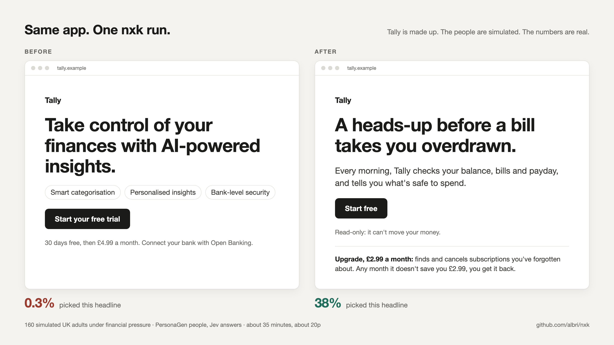

# From a generic landing page to one people pick

> **I gave an agent a deliberately generic landing page for a made-up
> budgeting app, Tally, and let it follow the answers. It changed who the app
> is for, what it does, what it costs and what it says. About 35 minutes, about
> 20p.**



Nobody planned the route there. Each answer sent the agent somewhere new:

**useless first question → wrong audience → wrong price → wrong features →
a guarantee instead of a discount → a headline selling something behind the
paywall → make that feature free**

Tally isn't real and the people are simulated. Every number is from a real run.

## How it got there

**Its first question was useless.**
It showed people the page and let them "scroll down to find out more". That
cost nothing, so in a five-person pilot about 80% picked it. It swapped in a
real choice: start the trial, carry on as now, or try a different app.

**Most people don't need it. People living paycheck to paycheck do.**
Of 200 UK adults, 14% would try a new money app in the next three months.
Among people living paycheck to paycheck, 40% would. So it drew 160 people
under high financial pressure and carried on with them.

**They'd leave because of the price. So what would they pay for?**
23% would start the trial. 78% said paying £4.99 a month when money is already
tight would put them off. Before touching the price, it asked what the app
should do for them.

**They want to know what's safe to spend. The page sold AI tips.**

| One feature to start with | Picked by |
| --- | ---: |
| Tells me how much I can safely spend each day until payday | 42% |
| Warns me before a payment takes me overdrawn | 33% |
| Finds subscriptions I've forgotten about | 17% |
| Sorts my spending into charts | 4% |
| AI-generated tips on where to cut back | 2% |

It rebuilt Tally around the top two, then went back to the price.

**A guarantee beat a discount.**

| Offer | Picked by |
| --- | ---: |
| Free safe-to-spend, with warnings in a £2.99 upgrade | 43% |
| £4.99, refunded any month it doesn't save you £4.99 | 29% |
| £1.99 a month | 12% |
| None of these | 15% |

Taking away the risk did more than cutting the price by 60%. So it put the
guarantee on the £2.99 upgrade too, and the share who'd pay went from 53% to
62%.

**The best headline sold something behind the paywall.**

| Headline | Picked by |
| --- | ---: |
| A heads-up before a bill takes you overdrawn. | 38% |
| Get to payday without the overdraft. | 25% |
| See what's safe to spend until payday. | 24% |
| Know what you can spend today, before you spend it. | 11% |
| Take control of your finances with AI-powered insights. | 0.3% |

The overdraft warning was in the paid upgrade, so the page would be leading
with something you can't have for free. It tried making the warnings free and
charging for cancelling forgotten subscriptions instead. The share who'd start
and then pay barely moved (53% vs 52%), so the warnings went free.

## Leads it didn't follow

- **Worry about connecting a bank.** 11% overall, 22% of the most
  privacy-cautious people. That's a small group, and the page already says
  it's read-only, so it left it.
- **Under-35s preferred a different headline.** They leaned towards "Get to
  payday without the overdraft." (34% vs 25%). Worth testing on a page aimed
  at them, but one page needs one headline.

## Did it hold up?

It ran everything after choosing the audience again, on 160 different people.

| Finding | First 160 | Second 160 |
| --- | ---: | ---: |
| £4.99 is what puts them off | 78% | 78% |
| AI tips as the most useful feature | 2% | 2% |
| Guarantee at £4.99 vs £1.99 a month | 29% vs 12% | 28% vs 12% |
| Winning headline vs the original | 38% vs 0.3% | 43% vs 0.3% |
| Start and pay: warnings paid vs free | 53% vs 52% | 49% vs 49% |

## Reading it properly

- These are model predictions for simulated people, not real customers. Read
  them for direction, not decimals.
- I left two numbers out. 92% said they'd start the free version; models are
  keen on anything new and free. Plain £4.99 got 1%, partly because it sat next
  to the same price with a refund.

## Try it on your own page

```text
Use nxk on our landing page. Find out who it's actually for, what puts them
off, what they'd want it to do, and which offer and headline they'd pick.
Follow whatever looks interesting, then rewrite the page.
```

[Every question, option and result →](data/budgeting-app-run.json)
